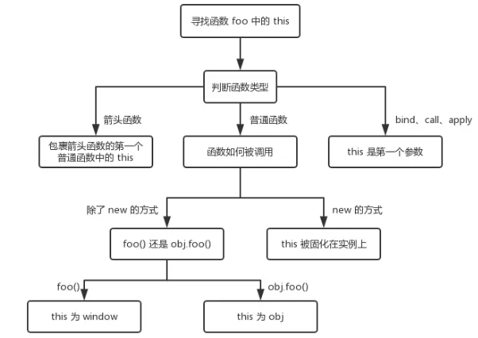
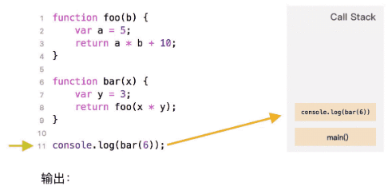

# 上下文与作用域链与闭包


## 上下文(context)

> JavaScript程序内部是如何执行的


### 什么是执行上下文

执行上下文就是当前 JavaScript 代码被解析和执行时所在环境的抽象概念， JavaScript 中运行任何的代码都是在执行上下文中运行。


### 执行上下文的类型

执行上下文总共有三种类型：

- 全局上下文：默认的、最基础的执行上下文。不在任何函数中的代码都位于全局执行上下文中。

  > 1、创建全局对象（浏览器中是window）
  >
  > 2、将this指针指向全局对象

- 函数执行的上下文：每次调用函数时，都会为该函数创建一个新的执行上下文。每个函数都拥有自己的执行上下文，但是只有在函数被调用的时候才会被创建。一个程序中可以存在任意数量的函数执行上下文。每当一个新的执行上下文被创建，它都会按照特定的顺序执行一系列步骤。

- Eval函数执行上下文：运行在 eval 函数中的代码也获得了自己的执行上下文。

```javascript
// 全局上下文 等同于window.say
var say = 'hi leslie';

// 全局上下文
function saySomething() {
	// 函数执行上下文
  var say = 'hi leslie';
  // 函数执行上下文
  function sayHi() {
      return say;
  }
  sayHi();
}
saySomething();
```


### 执行上下文的生命周期

执行上下文的生命周期包括三个阶段：**创建阶段 → 执行阶段 → 回收阶段**。


#### 创建阶段

当函数被调用，但未执行任何其内部代码之前，会做以下三件事：

- 创建变量对象：首先初始化函数的参数 arguments，**提升函数声明和变量声明**。
- 创建**作用域链**（Scope Chain）：在执行期上下文的创建阶段，作用域链是在变量对象之后创建的。作用域链本身包含变量对象。作用域链用于解析变量。当被要求解析变量时，JavaScript 始终从代码嵌套的最内层开始，如果最内层没有找到变量，就会跳转到上一层父作用域中查找，直到找到该变量。
- 确定 上下文(context)的值(this )指向： **this 的值是在执行的时候才能确认，定义的时候不能确认！**，因为 this 是执行上下文环境的一部分，而执行上下文需要在代码执行之前确定，而不是定义的时候。

> 在一段 JS 脚本执行之前，要先解析代码（所以说 JS 是解释执行的脚本语言），解析的时候会先创建一个全局执行上下文环境，先把代码中即将执行的变量、函数声明都拿出来。变量先暂时赋值为 undefined，函数则先声明好可使用。这一步做完了，然后再开始正式执行程序。
>
> 一个函数在执行之前，也会创建一个函数执行上下文环境，跟全局上下文差不多，不过 函数执行上下文中会多出 this arguments 和函数的参数。

```javascript
let person = {
  name: 'leslie',
  birthDay: '1956',
  say: function() {
    console.log('hi ' + this.name)
  }
}

// this 指向 person，因为 say 是被 person 对象引用调用的
person.say(); // hi leslie

// this 指向全局 window 对象，因为没有给出任何对象引用
let globalSay = person.say;
globalSay(); // hi
```

> 在全局执行上下文中，`this` 的值指向全局对象，在浏览器中，`this` 的值指向 window 对象。
>
> 在函数执行上下文中，`this` 的值取决于函数的调用方式。如果它被一个对象引用调用，那么 `this` 的值被设置为该对象，否则 `this` 的值被设置为全局对象或 `undefined`（严格模式下）。

```javascript
function foo() {
    console.log(this.a)
}
var a = 1;
foo(); // 1

function fn() {
    console.log(this);
}
var obj = {
    fn: fn,
}
obj.fn(); // {fn: fn}

function CreateJsPerson(name, age) {
    // this是当前类的一个实例p1
    this.name = name; // p1.name=name
    this.age = age; // p1.age=age
}
var p1 = new CreateJsPerson('leslie', 18);

function add (c, d) {
    return this.a + this.b + c + d;
}
var o = {
    a: 1,
    b: 3,
}
add(o, 5, 7); // 1 + 3 + 5 + 7 = 16
add.apply(o, [10, 20]); // 1 + 3 + 10 + 20 = 34

var obj = {
    name: 'kobe',
	age: 39,
	getName: function () {
		(() => {
			console.log(this); // obj
		})();
	}
};
obj.getName(); // {name: "kobe", age: 39, getName: ƒ}
```

> - 对于直接调用 foo 来说，不管 foo 函数被放在了什么地方，this 一定是 window
> - 对于 obj.foo() 来说，我们只需要记住，谁调用了函数，谁就是 this，所以在这个场景下 foo 函数中的 this 就是 obj 对象
> - 在构造函数模式中，类中(函数体中)出现的 this.xxx=xxx 中的 this 是当前类的一个实例
> - call、apply 和 bind：this 是第一个参数
> - 箭头函数 this 指向:箭头函数没有自己的 this，看其外层的是否有函数，如果有，外层函数的 this 就是内部箭头函数的 this，如果没有，则 this 是 window。



#### 执行阶段

执行变量赋值、代码执行

#### 回收阶段

执行上下文出栈等待虚拟机回收执行上下文


### 执行上下文栈

函数多了，就有多个函数执行上下文，每次调用函数创建一个新的执行上下文，那如何管理创建的那么多执行上下文呢？

JavaScript 引擎创建了执行上下文栈来管理执行上下文。**可以把执行上下文栈认为是一个存储函数调用的栈结构，遵循先进后出的原则**。



从上面的流程图，几个关键点：

- JavaScript 执行在单线程上，所有的代码都是排队执行。
- 一开始浏览器执行全局的代码时，首先创建全局的执行上下文，压入执行栈的顶部。
- 每当进入一个函数的执行就会创建函数的执行上下文，并且把它压入执行栈的顶部。当前函数执行完成后，当前函数的执行上下文出栈，并等待垃圾回收。
- 浏览器的 JS 执行引擎总是访问栈顶的执行上下文。
- 全局上下文只有唯一的一个，它在浏览器关闭时出栈

```javascript
var color = "blue";
function changeColor() {
    var anotherColor = "red";
    function swapColors() {
        var tempColor = anotherColor;
        anotherColor = color;
        color = tempColor;
    }
    swapColors();
}
changeColor();
```

上述代码运行按照如下步骤：

- 当上述代码在浏览器中加载时，JavaScript 引擎会创建一个全局执行上下文并且将它推入当前的执行栈
- 调用 `changeColor `函数时，此时 `changeColor`函数内部代码还未执行，js 执行引擎立即创建一个 `changeColor`的执行上下文（简称 EC），然后把这执行上下文压入到执行栈（简称 ECStack）中。
- 执行`changeColor`函数过程中，调用`swapColors`函数，同样地，`swapColors`函数执行之前也创建了一个`swapColors`的执行上下文，并压入到执行栈中。
- `swapColors`函数执行完成，`swapColors`函数的执行上下文出栈，并且被销毁。
- `changeColor`函数执行完成，`changeColor`函数的执行上下文出栈，并且被销毁。


## 作用域和作用域链


### 什么是作用域

作用域是在运行时代码中的某些特定部分中变量，函数和对象的可访问性。换句话说，作用域决定了代码区块中变量和其他资源的可见性。

```javascript
function outFun2() {
    var inVariable = "内层变量2";
}
outFun2();//要先执行这个函数，否则根本不知道里面是啥
console.log(inVariable); // Uncaught ReferenceError: inVariable is not defined
```


### 作用域的类型

- 全局作用域
- 局部作用域

#### 全局作用域

在代码中任何地方都能访问到的对象拥有全局作用域，一般来说以下几种情形拥有全局作用域：

1、最外层函数 和在最外层函数外面定义的变量拥有全局作用域

```javascript
var name = 'leslie';
console.log(name) // leslie

function say() {
    console.log(name)
}
say(); // leslie
```

#### 局部作用域

函数内定义的变量在局部（本地）作用域中。而且个函数被调用时都具有不同的作用域。这意味着具有相同名称的变量可以在不同的函数中使用。这是因为这些变量被绑定到它们各自具有不同作用域的相应函数，并且在其他函数中不可访问。

```javascript
function say() {
    age = 18; // 未定义并直接复制的变量，自动声明为拥有全局作用域
    var name = 'leslie';
    console.log(name);
}
say(); // leslie
console.log(name) // undefined
console.log(age) // 18
```


### 块语句

块语句，如 `if` 和 `switch` 条件语句或 `for` 和 `while` 循环语句，不像函数，它们不会创建一个新的作用域。在块语句中定义的变量将保留在它们已经存在的作用域中。

```javascript
if (true) {
    // 'if' 条件语句块不会创建一个新的作用域
    var name = 'leslie'; // name 依然在全局作用域中
}
 
console.log(name); // leslie
```

与 `var` 关键字相反，`let` 和 `const` 关键字支持在局部（本地）作用域的块语句中声明。

```javascript
if (true) {
    // 'if' 条件语句块不会创建一个新的作用域
 
    // name 在全局作用域中，因为通过 'var' 关键字定义
    var name = 'leslie';
    // likes 在局部（本地）作用域中，因为通过 'let' 关键字定义
    let likes = 'Coding';
    // skills 在局部（本地）作用域中，因为通过 'const' 关键字定义
    const skills = 'JavaScript';
}
 
console.log(name); // leslie
console.log(likes); // Uncaught ReferenceError: likes is not defined
console.log(skills); // Uncaught ReferenceError: skills is not defined
```


**注：作用域(scope) 是指变量的可访问性，上下文(context)是用来指定代码某些特定部分中 `this`的值，是指 `this` 在同一作用域内的值。**


### 作用域链 & 词法作用域

词法作用域意味着在一组嵌套的函数中，内部函数可以访问其父级作用域中的变量和其他资源。这意味着子函数在词法作用域上绑定到他们父级的执行期上下文。词法作用域有时也被称为静态作用域。

一层一层向上寻找，直到找到全局作用域还是没找到，就宣布放弃。这种一层一层的关系，就是 作用域链 。

```javascript
function grandfather() {
    var name = 'leslie';
    // likes 在这里不可以被访问
    function parent() {
        // name 在这里可以被访问
        // likes 在这里不可以被访问
        function child() {
            // 作用域链最深层
            // name 在这里也可以被访问
            var likes = 'Coding';
        }
    }
}
```

在不同执行上下文中具有相同名称的变量从执行堆栈的顶部到底部获得优先级。在最内层函数（执行堆栈的最上层上下文）中，具有类似于另一变量的名称的变量将具有较高优先级。

