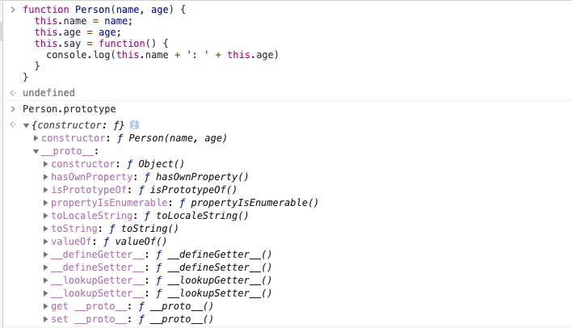

# 原型和继承


## JavaScript的原型

每个函数都有一个特殊的属性叫作`原型（prototype）`。

### 构造函数与原型

与大部分面向对象语言不同，JavaScript中并没有引入类（class）的概念，但JavaScript仍然大量地使用了对象，为了保证对象之间的联系，JavaScript引入了原型与原型链的概念。

```javascript
function Person(name, age) {
  this.name = name;
  this.age = age;
  this.say = function() {
    console.log(this.name + ': ' + this.age)
  }
}
var p1 = new Person('leslie', 18);
var p2 = new Person('bob', 28);
p1.say() // leslie: 18
p2.say() // bob: 28
```

上述代码就是声明一个构造函数并通过构造函数创建实例的过程。

在上面的代码中，有两个实例被创建，它们有自己的名字、年龄，但它们的`say`方法是一样的，而通过构造函数创建实例的时候，每创建一个实例，都需要重新创建这个方法，再把它添加到新的实例中。这无疑造成了很大的浪费，既然实例的方法都是一样的，为什么不把这个方法单独放到一个地方，并让所有的实例都可以访问到呢。

这里就需要用到**原型（prototype）**：

- 每一个构造函数都拥有一个prototype属性，这个属性指向一个对象，也就是原型对象。当使用这个构造函数创建实例的时候，prototype属性指向的原型对象就成为实例的原型对象。

- 原型对象默认拥有一个constructor属性，指向指向它的那个构造函数（也就是说构造函数和原型对象是互相指向的关系）。

- 每个对象都拥有一个隐藏的属性[[prototype]]，指向它的原型对象，这个属性可以通过 `Object.getPrototypeOf(obj)` 或 `obj.__proto__` 来访问。

- 实际上，构造函数的prototype属性与它创建的实例对象的[[prototype]]属性指向的是同一个对象，即 `对象.__proto__ === 函数.prototype` 。

- 如上文所述，原型对象就是用来存放实例中共有的那部分属性。

- 在JavaScript中，所有的对象都是由它的原型对象继承而来，反之，所有的对象都可以作为原型对象存在。

- 访问对象的属性时，JavaScript会首先在对象自身的属性内查找，若没有找到，则会跳转到该对象的原型对象中查找。



那么可以将上述代码稍微做些修改，这里把bark方法放入Dog构造函数的原型中：

```javascript
function Person(name, age) {
  this.name = name;
  this.age = age;
}
Person.prototype.say = function(){
  console.log(this.name + ': ' + this.age)
}
var p1 = new Person('leslie', 18);
var p2 = new Person('bob', 28);
p1.say() // leslie: 18
p2.say() // bob: 28
```

并且重写p2的say方法，不会对p1造成影响：

```javascript
function Person(name, age) {
  this.name = name;
  this.age = age;
}
Person.prototype.say = function(){
  console.log(this.name + ': ' + this.age)
}
var p1 = new Person('leslie', 18);
var p2 = new Person('bob', 28);
p2.say = function() {
  console.log(this.name + ': ' + this.age + '：update')
}
p1.say() // leslie: 18
p2.say() // bob: 28：update
```


## 原型链


## 如何使用原型链实现继承

