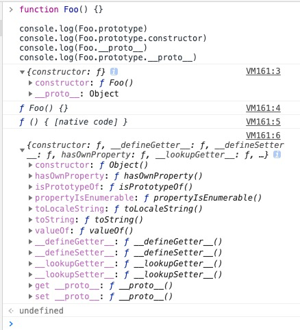

# 原型和继承


## JavaScript的原型

> 每个实例对象（ object ）都有一个私有属性（称之为 __proto__ ）指向它的构造函数的原型对象（prototype ）。该原型对象也有一个自己的原型对象( __proto__ ) ，层层向上直到一个对象的原型对象为 null。根据定义，null 没有原型，并作为这个原型链中的最后一个环节

### 构造函数与原型

avaScript 中除了基础类型外的数据类型，都是对象（引用类型），JavaScript中并没有引入类（class）的概念，但JavaScript仍然大量地使用了对象，为了保证对象之间的联系，JavaScript引入了原型与原型链的概念。

```javascript
function Person(name, age) {
  this.name = name;
  this.age = age;
  this.say = function() {
    console.log(this.name + ': ' + this.age)
  }
}
var p1 = new Person('leslie', 18);
var p2 = new Person('bob', 28);
p1.say() // leslie: 18
p2.say() // bob: 28
```

上述代码就是声明一个构造函数并通过构造函数创建实例的过程。

在上面的代码中，有两个实例被创建，它们有自己的名字、年龄，但它们的`say`方法是一样的，而通过构造函数创建实例的时候，每创建一个实例，都需要重新创建这个方法，再把它添加到新的实例中。这无疑造成了很大的浪费，既然实例的方法都是一样的，为什么不把这个方法单独放到一个地方，并让所有的实例都可以访问到呢。

这里就需要用到**原型（prototype）**：

- 每一个构造函数都拥有一个prototype属性，这个属性指向一个对象，也就是原型对象。当使用这个构造函数创建实例的时候，prototype属性指向的原型对象就成为实例的原型对象。

- 原型对象默认拥有一个constructor属性，指向指向它的那个构造函数（也就是说构造函数和原型对象是互相指向的关系）。

- 每个对象都拥有一个隐藏的属性[[prototype]]，指向它的原型对象，这个属性可以通过 `Object.getPrototypeOf(obj)` 或 `obj.__proto__` 来访问。

- 实际上，构造函数的prototype属性与它创建的实例对象的[[prototype]]属性指向的是同一个对象，即 `对象.__proto__ === 函数.prototype` 。

- 如上文所述，原型对象就是用来存放实例中共有的那部分属性。

- 在JavaScript中，所有的对象都是由它的原型对象继承而来，反之，所有的对象都可以作为原型对象存在。

- 访问对象的属性时，JavaScript会首先在对象自身的属性内查找，若没有找到，则会跳转到该对象的原型对象中查找。


那么可以将上述代码稍微做些修改，这里把bark方法放入Dog构造函数的原型中：

```javascript
function Person(name, age) {
  this.name = name;
  this.age = age;
}
Person.prototype.say = function(){
  console.log(this.name + ': ' + this.age)
}
var p1 = new Person('leslie', 18);
var p2 = new Person('bob', 28);
p1.say() // leslie: 18
p2.say() // bob: 28
```

并且重写p2的say方法，不会对p1造成影响，因为它重写say方法的操作实际上是为自己添加了一个新的方法使原型中的say方法被覆盖了，而并非直接修改了原型中的方法：

```javascript
function Person(name, age) {
  this.name = name;
  this.age = age;
}
Person.prototype.say = function(){
  console.log(this.name + ': ' + this.age)
}
var p1 = new Person('leslie', 18);
var p2 = new Person('bob', 28);
p2.say = function() {
  console.log(this.name + ': ' + this.age + '：update')
}
p1.say() // leslie: 18
p2.say() // bob: 28：update
```


## 原型链

JavaScript中所有的对象都是由它的原型对象继承而来。而原型对象自身也是一个对象，它也有自己的原型对象，这样层层上溯，就形成了一个类似链表的结构，这就是**原型链（prototype chain）**。

所有原型链的终点都是Object函数的prototype属性，因为在JavaScript中的对象都默认由Object()构造。Object.prototype指向的原型对象同样拥有原型，不过它的原型是null，而null则没有原型。

原型链和原型对象是js的核心，js以原型链的形式，保证函数或对象中的方法、属性可以让向下传递，按照面向对象的说法，这就是继承。

### prototype和contructor

**prototype指向函数的原型对象，这是一个显式原型属性，只有函数才拥有该属性**。**contructor**指向原型对象的构造函数。

```javascript
// 可以思考一下的打印结果，它们分别指向谁
function Foo() {}

console.log(Foo.prototype)
console.log(Foo.prototype.constructor)
console.log(Foo.__proto__)
console.log(Foo.prototype.__proto__)
```



### proto

每个对象都有`_proto_`，它是隐式原型属性，指向了创建该对象的构造函数原型。由于js中是没有类的概念，而为了实现继承，通过 `_proto_` 将对象和原型联系起来组成原型链，就可以让对象访问到不属于自己的属性。

Foo、Function和Object都是函数，它们的`_proto_`都指向`Function.prototype`。

### 原型对象之间的关系

它们的`_proto_`都指向了`Object.prototype`。js原型链最终指向的是Object原型对象

### _proto_原型链图

### 总结

- Function 和 Object 是两个函数。
- proto 将对象和原型连接起来组成了原型链。
- 所有的函数的 **proto** 都指向Function原型对象。
- **js的原型链最终指向的是Object原型对象(Object.prototype)**（在这里我将null排除在外了）。


## 如何使用原型链实现继承

### 原型链

```javascript
function Person() {
    this.name = 'leslie';
}
function Me() {
    
}
Me.prototype = new Person();
const instance = new Me();
console.log(instance.name); // leslie
```

因为此模式会共享属性和方法，所以当一个实例修改属性和方法时会影响其他实例，而且子类型无法向超类型传递参数。综上，不推荐使用此模式。

### 构造函数

```javascript
function Person(name) {
    this.name = name;
}
function Me() {
    Person.call(this, 'leslie')
}
const instance = new Me();
console.log(instance.name); // leslie
```

此模式的优缺点：

1. 每一个child的实例都有name属性的副本，避免了属性修改的传染性。
2. 子类型可以向超类型传递参数
3. 函数无法复用

### 组合继承

```javascript
function Person(name) {
    this.name = name;
}
Person.prototype.sayName = () => {
    console.log(this.name);
}
function Me(name) {
    Person.call(this, name)
}
Me.prototype = new Person();
Me.prototype.constructor = Me;
```

### 原型式继承

```javascript
const person = {
    name: 'leslie',
    age: 18,
}
function Me(original){
    function F() {}
    F.prototype = original
    return new F()
}
const anotherPerson = Object.create(person)
```

### 寄生式继承

```javascript
const person = {
    name: 'leslie',
    age: 18,
}
function createAnother(original){
    const clone = Object.create(original);
    clone.say = () => {
        console.log('hello');
    }
}
var anotherPerson = createAnother(person)
anotherPerson.say();  //hello
```

### 寄生组合式继承

```javascript
function inheritPrototype(child, parent) {
    const portotype = Object.create(parent)
    prototype.constructor = child 
    child.prototype = prototype
}
```

