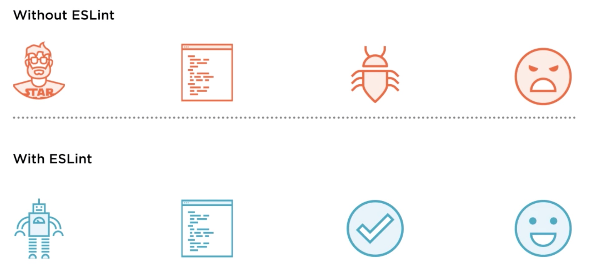
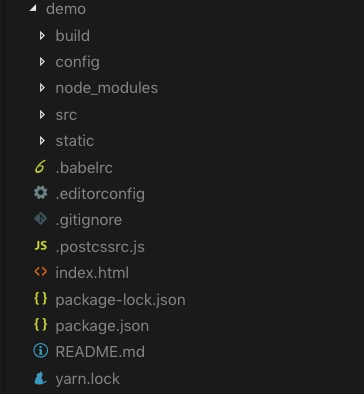
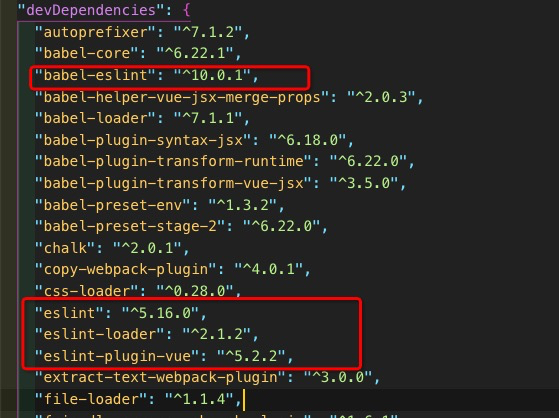
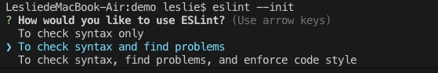
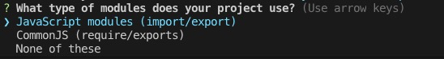
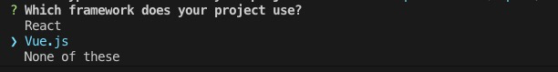
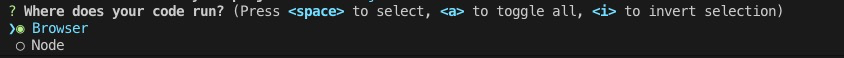
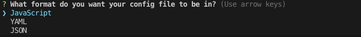
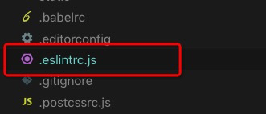

# Eslint
<center>


</center>

## Eslint是什么
Lint 是检验代码格式工具的一个统称，具体的工具有 Jslint 、 Eslint 等等。ESLint是一个用来识别 ECMAScript 并且按照规则给出报告的代码检测工具，使用它可以避免低级错误和统一代码的风格。

## 为什么要使用eslint
每个人都有自己的编码习惯，例如：

- 有些人喜欢每一行代码结尾添加`;`<br>
- 有些人在定义变量时，直接就赋值，`a = 10`<br>
- 有的人喜欢把所有逻辑都写在一行代码上<br>
- ......

在工作中，如何每个小组成员都按自己的喜好来编写代码，那么这个项目随着功能的迭代，代码会越来越乱，十分不利于维护和理解。这个时候，就需要有一套规则来规范代码编写，统一代码风格。这时候就体现了eslint的好处：

- 提供编码规范<br>
- 避免错误定义<br>
- 提供自动检验代码的程序，并打印检验结果：告诉你哪一个文件哪一行代码不符合哪一条编码规范，方便你去修改代码<br>
- ......

<center>



</center>

## 如何在项目中使用eslint
示例基于vue-cli2.x版本配置，初始化目录如下：

<center>



</center>

### 安装
> ESLint是基于Node的，所以在使用之前，请确保Node已经安装，本次示例以本地项目安装为例
- 本地项目安装
`npm install eslint --save-dev`

- 全局安装
`npm install -g eslint `

- 安装完eslint之后，仍需继续安装其他依赖包
```
// 安装eslint-loader 在webpack中解析
// 安装babel-eslint  对Babel解析器的包装与ESLint兼容
// 安装eslint-plugin-vue vue默认规则
// -D 安装在开发依赖环境 devDependencies 原--save-dev的简写
npm i eslint-loader babel-eslint eslint-plugin-vue -D
```
安装完成后，package.json中如下：

<center>



</center>

- 生成配置文件，初始化
`eslint --init`

选择第二行检查语法并发现问题

<center>



</center>

选择第一行

<center>



</center>

选择Vue.js

<center>



</center>

选择Browser

<center>



</center>

选择JavaScript

<center>



</center>

选择JavaScript

<center>


</center>

运行eslint –init后，会在当前目录下生成一个.eslintrc文件

<center>



</center>

### 配置
- 配置.eslintrc.js文件，[详细规则rules](https://cn.eslint.org/docs/rules/)
```js
// .eslintrc.js
module.exports = {
    // 指定脚本的运行环境
    "env": {
        "browser": true,
        "es6": true
    },
    // 继承已启用的基础规则
    "extends": [
        "eslint:recommended",
        "plugin:vue/essential"
    ],
    // 脚本在执行期间访问的额外的全局变量
    "globals": {
        "Atomics": "readonly",
        "SharedArrayBuffer": "readonly"
    },
    // 指定解析器选项
    "parserOptions": {
        "ecmaVersion": 2018,
        "sourceType": "module"
    },
    "plugins": [
        "vue"
    ],
    // 启用的规则及其各自的错误级别
    "rules": {
    }
};
```

- 配置.eslintignore文件，在根目录新建.eslintignore文件，来忽略不需要校验的文件
```
/build/
/config/
/dist/
/*.js
```

- 将配置好的规则添加到webpack中对js文件检查
```js
// webpack.config.js
module.exports = {
    entry: '',
    output: {},
    module: {
        rules: [
            {
                test: /\.js$/,
                use: ['babel-loader', 'eslint-loader']
            }
        ]
    },
    plugins: [],
    devServer: {}
};
```

## 当前工作项目中的eslint
了解完安装、引入和配置后，我们开始了解项目中具体的配置及使用。

- 安装eslint`@fe-base/eslint-config`


## 如何处理eslint报错

## 如何自己配置eslint